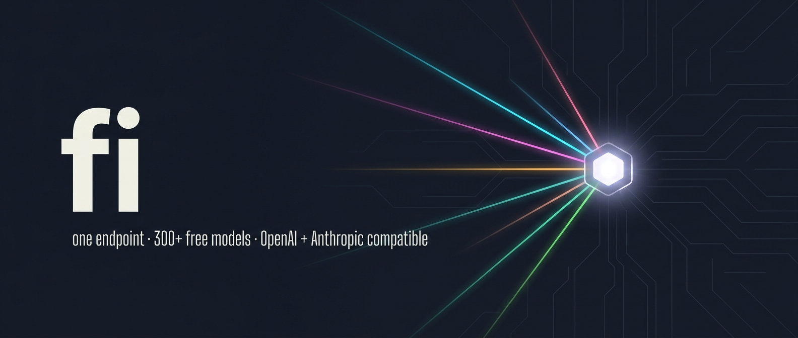

<p align="center">
  
</p>

<h1 align="center">fi-gateway</h1>

<p align="center">
  <strong>Wire your coding agent to free LLMs.</strong><br>
  One endpoint speaking OpenAI <em>and</em> Anthropic <em>and</em> embeddings shapes.<br>
  Claude Code, opencode, pi-mono — auto-configured.
</p>

<p align="center">
  <a href="LICENSE"></a>
  
  
  
</p>

---

## Quickstart

**1.** Get the repo. Either install as a skill (Claude Code / opencode / pi / 41 other agents pick it up automatically) or clone directly:

```bash
# Option A — skill install (recommended for agent users)
npx skills add bradagi/fi-gateway

# Option B — direct clone (no Node, no skill registration; just the CLI)
git clone https://github.com/bradAGI/fi-gateway && cd fi-gateway
```

**2.** Add free keys, boot the proxy, verify what works:

```bash
./fi keys add gemini AIza...
./fi keys add nvidia nvapi-...
./fi keys add openrouter sk-or-...

./fi start                  # prints the master key (sk-fi-…)
./fi probe                  # parallel smoke test, caches working/broken
./fi reload                 # regenerate config, expose only verified models
```

**3.** Wire any coding agent CLIs you have installed:

```bash
./fi wire cc                # Claude Code   → ~/.claude/settings.json
./fi wire opencode          # opencode      → ~/.config/opencode/opencode.json
./fi wire pi                # pi-mono       → ~/.pi/agent/models.json
./fi wire openclaw          # openclaw      → ~/.openclaw/config.yaml      (via `openclaw onboard`)
./fi wire hermes            # hermes-agent  → ~/.hermes/config.yaml        (via `hermes config set`)
```

That's it — your wired agent now routes through `localhost:4000` using your free keys. Every wired tool gets a clean `/v1/models` list of probe-verified callable aliases.

> **Custom port?** Export `FI_PORT=8080` (or any free port) before any `./fi` invocation and the gateway, doctor output, wire URLs, and probe all use it. Container-internal port is always 4000; only the host-side mapping changes.

## Talk to your agent

The skill teaches your agent how to drive the gateway. Examples:

> *"Add my gemini key AIza…"* → `./fi keys add gemini …` + `./fi reload`
> *"Wire me up for Claude Code"* → `./fi wire cc` (auto-backs up settings.json)
> *"What free models do I have?"* → `./fi probe` + `./fi models --working`
> *"Show me a health check"* → `./fi doctor`
> *"Why is `<alias>` failing?"* → `./fi logs` + diagnosis

## Features

| | |
|---|---|
| **One endpoint, three shapes** | `/v1/chat/completions` (OpenAI), `/v1/messages` (Anthropic), `/v1/embeddings` |
| **~150-model catalog** | Gemini, Gemma, Groq, OpenRouter free, NVIDIA NIM, Cerebras, Mistral, Scaleway, Voyage, Jina, Mixedbread, Nomic, Pollinations, Cohere, Together, Hunyuan, Chutes, LLM7, Ollama Cloud |
| **Auto-discovery** | OpenRouter, NVIDIA, Gemini, Pollinations refresh from live `/v1/models` (24h cache); image/video/audio/parser endpoints filtered upstream |
| **Probe + auto-exclude** | `./fi probe` smoke-tests every alias; broken ones never reach `/v1/models` after `./fi reload` |
| **Embeddings as first class** | `embed`-tagged aliases probed via `/v1/embeddings`; vectors flow through the same master key |
| **Deterministic routing** | Capability tags (`fast`/`smart`/`vision`/`embed`/`code`/`reasoning`) are filter metadata only — every request names a concrete model, never a group |
| **Key rotation** | Add multiple keys per provider; router round-robins for 2× effective RPD |
| **Lightweight** | Single Python file, stdlib only. Only host requirement: `docker compose` |

## Use it from any SDK

```python
# Chat
from openai import OpenAI
client = OpenAI(base_url="http://localhost:4000/v1", api_key="sk-fi-…")
client.chat.completions.create(
    model="gemini-2.5-flash",       # any alias from ./fi models --working
    messages=[{"role": "user", "content": "Hello"}],
)

# Embeddings
client.embeddings.create(model="gemini-embedding-001", input="vectorize me")

# Anthropic shape — works against every model in your catalog, not just real Anthropic
from anthropic import Anthropic
client = Anthropic(base_url="http://localhost:4000", api_key="sk-fi-…")
client.messages.create(
    model="gemini-2.5-pro",
    max_tokens=256,
    messages=[{"role": "user", "content": "Hello"}],
)
```

## CLI

```
Lifecycle    ./fi start | stop | restart | reload | status | logs [-f]
Health       ./fi doctor                        proxy + providers + keys + probe age + drift + wired clients
Keys         ./fi keys add <provider> <key>
             ./fi keys list | remove <provider> [--index N]
Catalog      ./fi providers                     active vs inactive
             ./fi models [-g GROUP] [-w/--working | --broken]
             ./fi sync                          refresh auto-discovered catalogs
             ./fi config show | path
Smoke test   ./fi test <alias> [--prompt P]            OpenAI shape
             ./fi test-anthropic <alias> [--prompt P]  Anthropic shape
Probe        ./fi probe [-g GROUP] [-p PROVIDER] [-c N] [-t SEC] [--include-broken]
Wiring       ./fi detect                        scan installed agent CLIs
             ./fi wire cc | opencode | pi | openclaw | hermes
             ./fi unwire cc | opencode | pi | openclaw | hermes
```

## Probe + auto-exclude

The catalog tells you what *might* work; probe tells you what *does* work for your account.

```bash
./fi probe                      # parallel smoke test
./fi probe --group code         # narrow to a tag
./fi probe --provider gemini    # narrow to a provider
./fi probe --include-broken     # also retest previously-failed aliases
./fi models --working           # filter the catalog to verified hits
```

Each run writes `~/.config/free-inference/.probe-cache.json` with status, latency, and error class per alias. On the next `./fi reload`, broken aliases are excluded from `config.yaml` — the router never picks them, clients never see them in `/v1/models`. `./fi sync` prunes stale entries when upstreams rotate their catalogs.

## Auto-discovery

| Kind | Source | Cache |
|------|--------|-------|
| `openrouter_free` | `openrouter.ai/api/v1/models` filtered to `pricing.prompt == 0` | 24h |
| `nvidia_nim` | `integrate.api.nvidia.com/v1/models` | 24h |
| `gemini` | `generativelanguage.googleapis.com/v1beta/openai/models` | 24h |
| `pollinations` | `gen.pollinations.ai/v1/models` (keyless) | 24h |

Each handler classifies discovered ids into `chat / embed / rerank / drop`. Image / video / audio / TTS / document-parser / deprecated endpoints are dropped at discovery — they never enter the catalog. Embedding models stay in catalog with the `embed` tag and are probed via `/v1/embeddings`.

> Hugging Face routing is **not** in the default catalog — the $0.10/mo free credit on non-PRO accounts runs out fast. Add it manually if you have a PRO subscription.

## Adding a provider

Append one TOML block, then `./fi reload`:

```toml
[[provider]]
name = "your-provider"
key_env = "YOURPROVIDER_API_KEY"
base_url = "https://api.yours.example/v1"
litellm_prefix = "openai"              # or "gemini", "cohere", "nvidia_nim", …

[[provider.model]]
alias = "yours-flagship"
upstream = "their/model-id"
groups = ["smart", "vision"]            # filter tags only — not callable aliases
```

Use `discovery = "<kind>"` instead of static models if the provider exposes a `/v1/models` endpoint that should refresh on its own.

## Layout

```
fi-gateway/              # skill root == repo root
├── SKILL.md             # what your agent reads to learn how to drive fi
├── fi                   # single-file Python CLI (stdlib only)
├── providers.toml       # catalog
├── docker-compose.yml   # one service: LiteLLM proxy
└── README.md
```

User state in `~/.config/free-inference/` (gitignored, 600):

| File | Lifecycle |
|------|-----------|
| `keys.env` | written by `./fi keys add` |
| `config.yaml` | regenerated each `./fi start` / `./fi reload`; auto-excludes probe-failed aliases |
| `.discovery-cache.json` | upstream catalog snapshots, 24h TTL |
| `.probe-cache.json` | per-alias verify results, 24h TTL |

## Caveats

- **Wiring locks your tool to gateway liveness** — kill the proxy and your wired client errors until restart. `./fi unwire <tool>` reverts via the `.fi-backup` file.
- **NVIDIA NIM gating** — many endpoints require separate per-account approval and silently 404 ("Function not found"). Probe catches this.
- **OpenRouter free-pool 429s** — aggressive shared-tier rate limits on popular free models (gemma, llama, qwen-coder). Re-run probe after the window resets.
- **Anthropic-shape translation** — the `openai` litellm prefix routes `/v1/messages` through OpenAI's Responses API which most upstreams don't expose. Use the dedicated prefix (`nvidia_nim`, `cohere`, `gemini`) when available.
- **Streaming tool-calls** — event order may differ subtly from native Anthropic for edge cases; standard streaming works fine.
- **`cache_control` blocks** are stripped on `/v1/messages` for non-Anthropic upstreams — free providers don't have prompt caching.

## Requirements

Python 3.11+ · `docker compose` · Linux / macOS / WSL2.

## License

MIT
